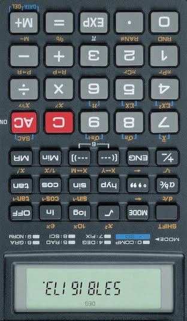

# CalculatorPrimes

This script will find the largest _Calculator Prime_ - a prime number that when displayed on a classical calculator and turned upsaide down, shows a dictionary word.

**To run:**

    python3 calcPrimes.py  "resources/sortedWords.txt"

The largest Calculator Prime found so far is

    537816173  ELIGIBLES

This was found using the Collins Scrabble Dictionary 2019.

Note: It's not clear whether words ending in "O" - that is, numbers starting with zero should be allowed. But this does not affect the current highest known _Calculator Prime_.

